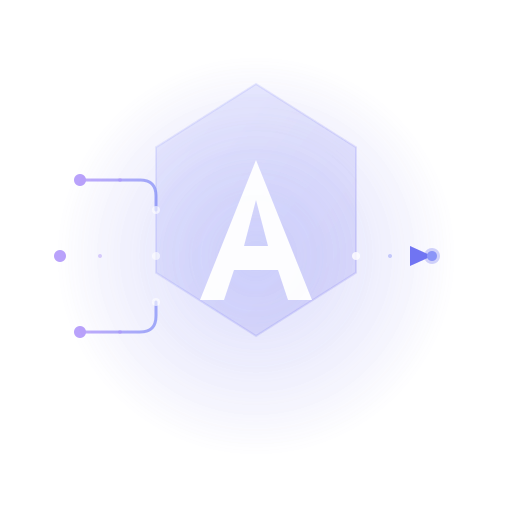

# Aura Chat

A modern chat interface for testing the Aura LLM Gateway. Built with React, TypeScript, and Tailwind CSS.



## Features

- **Multi-Model Support** - Switch between OpenAI, Anthropic, and Google models
- **Streaming Responses** - Real-time streaming with typing indicators
- **Conversation History** - Persistent chat history with localStorage
- **Agent Mode** - Built-in tools for enhanced AI capabilities
- **Dark/Light Mode** - Automatic theme detection with manual toggle
- **Markdown Rendering** - Full markdown support with syntax highlighting
- **Responsive Design** - Works on desktop and mobile

## Quick Start

```bash
# Install dependencies
npm install

# Start development server
npm run dev

# Build for production
npm run build
```

## Environment Variables

Create a `.env` file in the `apps/chat/` directory:

```env
# Aura Gateway URL (defaults to localhost:8080)
VITE_API_BASE_URL=http://localhost:8080

# Tavily API key for web search (optional)
VITE_TAVILY_API_KEY=tvly-xxxxxxxxxxxxx
```

## Available Models

### OpenAI
- GPT-5.5-pro / GPT-5.5
- GPT-5.4 / GPT-5.4-mini / GPT-5.4-nano
- o1, o3-mini (reasoning)
- GPT-4o, GPT-4-turbo (legacy)

### Anthropic
- Claude Opus 4.7
- Claude Opus 4.6 / Sonnet 4.6
- Claude Opus 4.5 / Sonnet 4.5 / Haiku 4.5
- Claude 3.7 Sonnet, 3.5 Sonnet (legacy)

### Google
- Gemini 3 Pro, Gemini 3 Flash
- Gemini 2.5 Pro, Gemini 2.0 Flash

## Agent Tools

When agent mode is enabled, the following tools are available:

| Tool | Description |
|------|-------------|
| `get_current_time` | Get current date/time in any timezone |
| `calculate` | Perform mathematical calculations |
| `web_search` | Search the web using Tavily API |
| `get_weather` | Get weather information (simulated) |

### Tavily Web Search

To enable real web search:

1. Sign up at [tavily.com](https://tavily.com)
2. Get your API key
3. Add it to your `.env` file as `VITE_TAVILY_API_KEY`

## Project Structure

```
apps/chat/
├── public/
│   └── aura-icon.svg
├── src/
│   ├── components/
│   │   ├── ChatContainer.tsx    # Main chat area
│   │   ├── ChatInput.tsx        # Message input
│   │   ├── Header.tsx           # Top bar with model selector
│   │   ├── MessageBubble.tsx    # Individual messages
│   │   ├── Sidebar.tsx          # Conversation list
│   │   └── WelcomeScreen.tsx    # Empty state
│   ├── hooks/
│   │   ├── useChat.ts           # Chat logic (legacy)
│   │   └── useConversations.ts  # Conversation management
│   ├── lib/
│   │   ├── agent.ts             # Tool definitions and execution
│   │   ├── api.ts               # API client
│   │   ├── storage.ts           # localStorage utilities
│   │   ├── types.ts             # TypeScript types
│   │   └── utils.ts             # Helper functions
│   ├── stores/
│   │   └── chatStore.ts         # Zustand state management
│   ├── App.tsx                  # Main application
│   ├── main.tsx                 # Entry point
│   └── index.css                # Global styles
├── package.json
├── tailwind.config.js
├── tsconfig.json
└── vite.config.ts
```

## State Management

Chat state is managed with Zustand and persisted to localStorage:

```typescript
import { useChatStore } from './stores/chatStore'

const {
  conversations,
  currentConversationId,
  model,
  createConversation,
  selectConversation,
  addMessage,
  setModel,
} = useChatStore()
```

## Connecting to the Gateway

The chat app connects to the Aura Gateway's `/v1/responses` endpoint:

```typescript
// The gateway URL is configurable via environment variable
const API_BASE = import.meta.env.VITE_API_BASE_URL || 'http://localhost:8080'

// Requests follow the Open Responses API format
const response = await fetch(`${API_BASE}/v1/responses`, {
  method: 'POST',
  headers: { 'Content-Type': 'application/json' },
  body: JSON.stringify({
    model: 'gpt-5.4-mini',
    input: [{ type: 'message', role: 'user', content: 'Hello!' }],
    stream: true,
  }),
})
```

## Development

```bash
# Run with hot reload
npm run dev

# Type checking
npx tsc --noEmit

# Lint
npm run lint

# Build
npm run build

# Preview production build
npm run preview
```

## Tech Stack

- **React 18** - UI framework
- **TypeScript** - Type safety
- **Vite 5** - Build tool
- **Tailwind CSS** - Styling
- **Zustand** - State management
- **Lucide React** - Icons
- **React Markdown** - Markdown rendering
- **React Syntax Highlighter** - Code highlighting

## Future Improvements

- [ ] AI SDK integration for advanced agent features
- [ ] Voice input/output
- [ ] File upload support
- [ ] Export conversations (JSON, Markdown, PDF)
- [ ] Conversation sharing
- [ ] Custom system prompts UI
- [ ] Token count display
- [ ] Cost tracking per conversation

## Integration with Admin Dashboard

This chat app will be integrated into the Aura Admin Dashboard as the "Playground" feature. See [docs/internal/admin-app-plan.md](../../docs/internal/admin-app-plan.md) for details.

## License

MIT
