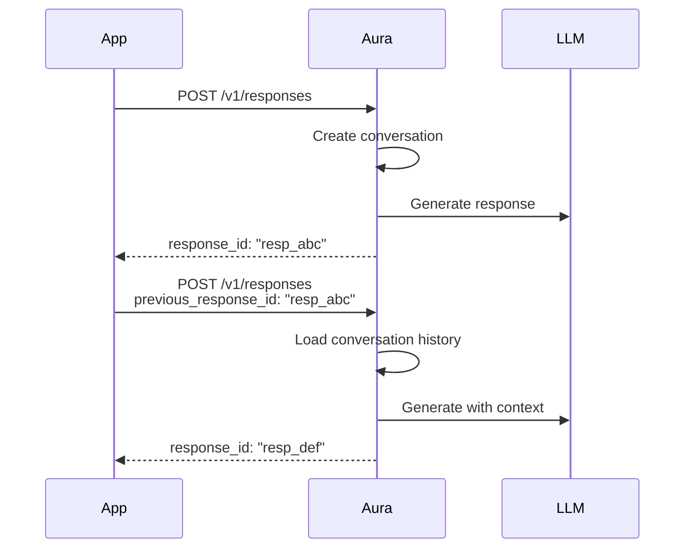

# Conversations

Aura supports stateful conversations through automatic threading. Each response can reference a previous response, maintaining context across multiple turns.

## How It Works

When you include `previous_response_id` in your request, Aura automatically:

1. Loads the previous response from the database
2. Prepends the conversation history to your new input
3. Creates a new response in the same conversation thread
4. Returns the response with full context awareness



## Basic Usage

### First Message (Start Conversation)

```bash
curl -X POST https://api.aura-llm.dev/v1/responses \
  -H "Authorization: Bearer aura_live_..." \
  -H "Content-Type: application/json" \
  -d '{
    "model": "gpt-4.5",
    "input": [
      {"type": "message", "role": "user", "content": "My name is Alice."}
    ]
  }'
```

Response:
```json
{
  "id": "resp_abc123",
  "model": "gpt-4.5",
  "status": "completed",
  "output": [
    {
      "type": "message",
      "role": "assistant",
      "content": "Hello Alice! Nice to meet you. How can I help you today?"
    }
  ]
}
```

### Follow-up Message (Continue Conversation)

```bash
curl -X POST https://api.aura-llm.dev/v1/responses \
  -H "Authorization: Bearer aura_live_..." \
  -H "Content-Type: application/json" \
  -d '{
    "model": "gpt-4.5",
    "previous_response_id": "resp_abc123",
    "input": [
      {"type": "message", "role": "user", "content": "What is my name?"}
    ]
  }'
```

Response:
```json
{
  "id": "resp_def456",
  "model": "gpt-4.5",
  "status": "completed",
  "output": [
    {
      "type": "message",
      "role": "assistant",
      "content": "Your name is Alice, as you mentioned at the start of our conversation."
    }
  ]
}
```

The model remembers the context from the previous turn!

## Managing Conversations

### List Conversations

```http
GET /v1/conversations
Authorization: Bearer aura_live_...
```

Response:
```json
{
  "conversations": [
    {
      "id": "conv_abc123",
      "title": "My name is Alice",
      "model_id": "gpt-4.5",
      "message_count": 4,
      "created_at": "2026-01-27T10:00:00Z",
      "updated_at": "2026-01-27T10:05:00Z"
    }
  ]
}
```

### Get Conversation Details

```http
GET /v1/conversations/{conversation_id}
Authorization: Bearer aura_live_...
```

Response:
```json
{
  "id": "conv_abc123",
  "title": "My name is Alice",
  "model_id": "gpt-4.5",
  "messages": [
    {"role": "user", "content": "My name is Alice."},
    {"role": "assistant", "content": "Hello Alice! Nice to meet you..."},
    {"role": "user", "content": "What is my name?"},
    {"role": "assistant", "content": "Your name is Alice..."}
  ],
  "metadata": {
    "total_tokens": 150,
    "total_cost_usd": 0.0045
  }
}
```

### Delete Conversation

```http
DELETE /v1/conversations/{conversation_id}
Authorization: Bearer aura_live_...
```

## Automatic Features

### Title Generation

Conversations are automatically titled based on the first user message (truncated to ~50 chars).

### Usage Tracking

Each conversation tracks cumulative usage:
- Total input tokens
- Total output tokens
- Total cost in USD

### Response Storage

All responses in a conversation are stored with:
- Full request/response data (JSONB)
- Token usage per turn
- Cost per turn
- Latency metrics

## SDK Examples

### Python

```python
from aura import AuraClient

client = AuraClient(base_url="https://api.aura-llm.dev")

# Start conversation
response1 = client.responses.create(
    model="gpt-4.5",
    input="My name is Alice."
)

# Continue conversation
response2 = client.responses.create(
    model="gpt-4.5",
    input="What is my name?",
    previous_response_id=response1.id
)

print(response2.output_text)  # "Your name is Alice..."
```

### Streaming with Threading

```python
# Stream a follow-up response
for event in client.responses.create(
    model="gpt-4.5",
    input="Tell me a joke about my name.",
    previous_response_id=response2.id,
    stream=True
):
    if event.type == "response.output_text.delta":
        print(event.delta, end="")
```

## Best Practices

1. **Store response IDs** - Save `response.id` to continue conversations later
2. **Use same model** - Switching models mid-conversation may lose context
3. **Monitor token usage** - Long conversations accumulate tokens quickly
4. **Set limits** - Use `max_tokens` to prevent runaway costs
5. **Clean up old conversations** - Delete conversations you no longer need

## Database Schema

Conversations are stored in PostgreSQL:

```sql
-- Conversations table
conversations (
  id UUID PRIMARY KEY,
  title VARCHAR(255),
  model_id VARCHAR(100),
  user_id VARCHAR(255),
  metadata JSONB,
  created_at TIMESTAMPTZ,
  updated_at TIMESTAMPTZ
)

-- Responses table (stores each turn)
responses (
  id UUID PRIMARY KEY,
  response_id VARCHAR(100) UNIQUE,  -- "resp_abc123"
  conversation_id UUID REFERENCES conversations,
  previous_response_id VARCHAR(100),
  request JSONB,
  response JSONB,
  input_tokens INTEGER,
  output_tokens INTEGER,
  cost_usd DOUBLE PRECISION
)

-- Messages table (simplified view)
messages (
  id UUID PRIMARY KEY,
  conversation_id UUID REFERENCES conversations,
  role VARCHAR(50),
  content TEXT,
  created_at TIMESTAMPTZ
)
```
