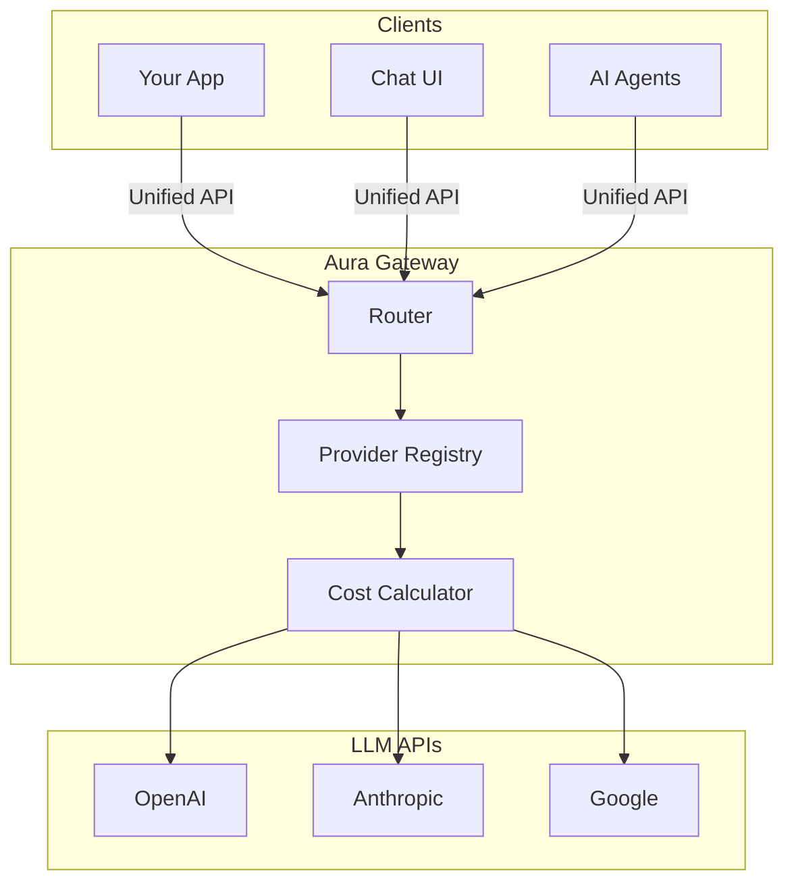
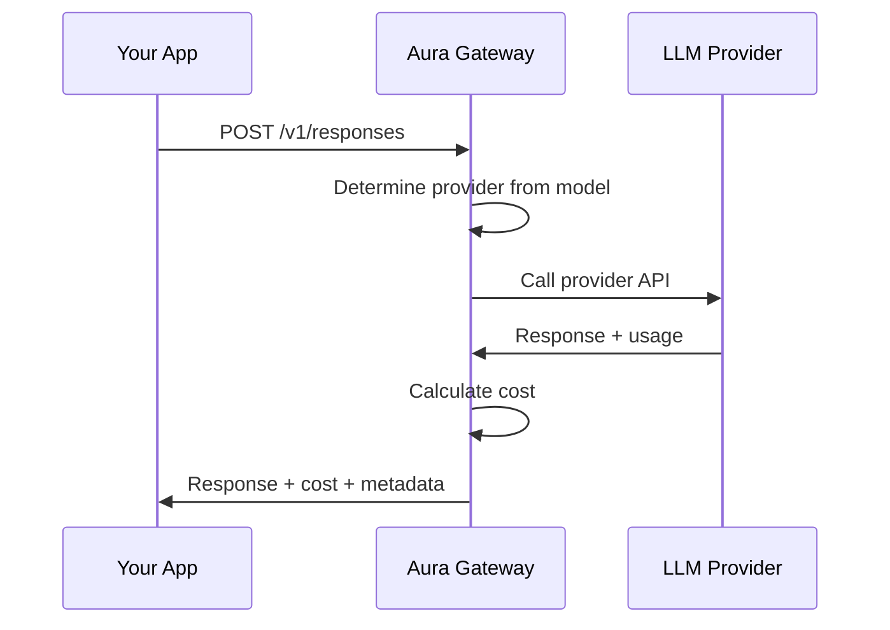
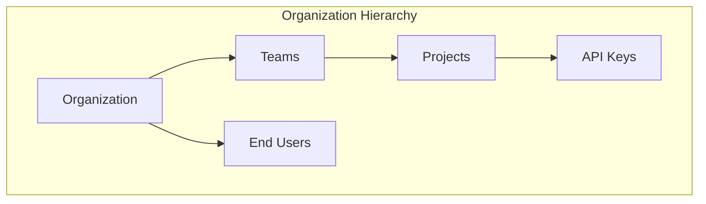
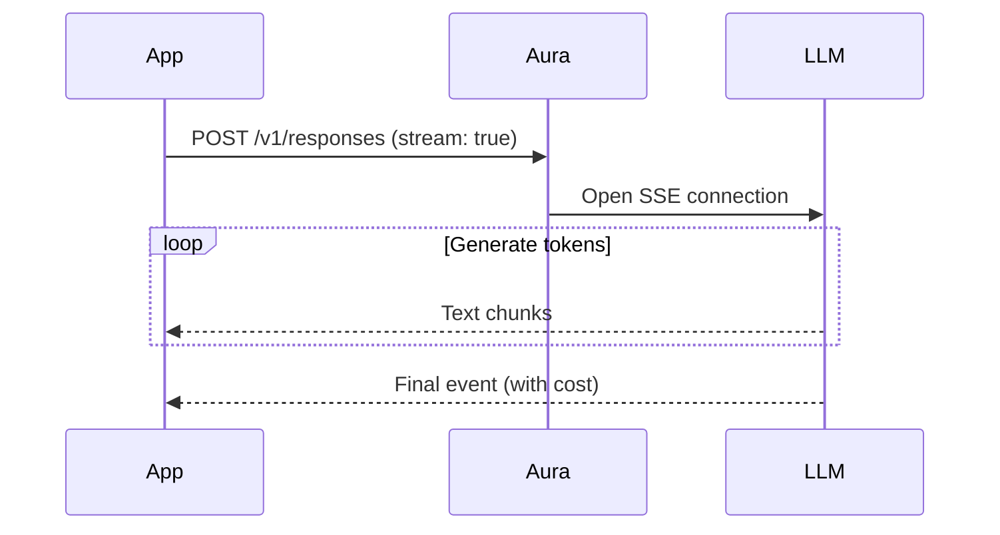
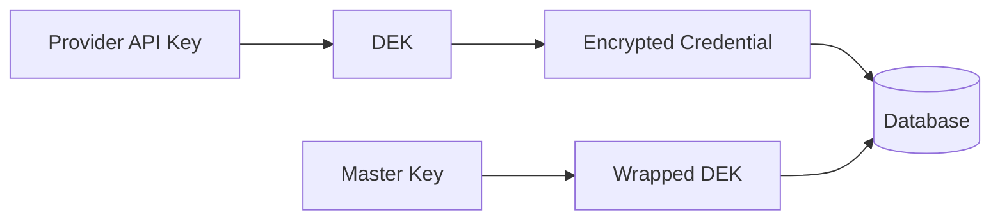
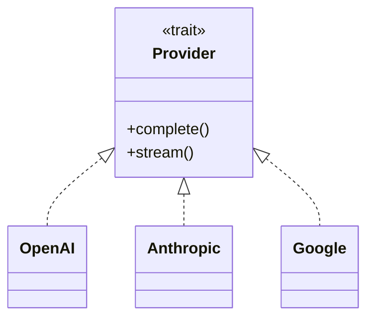

# Architecture

## What is Aura?

Aura is a high-performance LLM gateway built in Rust. It sits between your applications and LLM providers (OpenAI, Anthropic, Google), providing a unified API with automatic cost tracking and observability.



**Why use Aura?**

- **One API for all providers**: Use the same request format for OpenAI, Anthropic, and Google
- **Automatic cost tracking**: Every response includes exact USD cost
- **Built-in observability**: Latency, provider info, and metadata on every request
- **Multi-tenant ready**: Organizations, teams, projects with scoped API keys
- **Secure by default**: API key authentication with encrypted provider credentials

## How It Works

When you make a request to Aura, here's what happens:



**Step by step:**

1. Your app sends a request to Aura (e.g., model: "gpt-4.5")
2. Aura determines which provider to use (gpt-4.5 → OpenAI)
3. Aura calls the provider's API
4. Provider responds with the generated text and token usage
5. Aura calculates the cost in USD
6. Aura adds metadata (cost, latency, provider) and returns the response

**Performance:** Aura adds ~10ms overhead. A typical request takes 200-500ms total (mostly waiting for the LLM).

## Authentication & Multi-Tenancy

Aura uses API key authentication with a hierarchical organization model:



**Key concepts:**

- **Organizations**: Top-level billing entities (your company)
- **Teams**: Departments or product groups
- **Projects**: Specific initiatives or applications
- **API Keys**: Scoped to org, team, project, or user level
- **End Users**: Your customers (for cost allocation)

**API Key Format:**

```
aura_live_<random_32_chars>   # Production keys
aura_test_<random_32_chars>   # Test/development keys
```

**Request with authentication:**

```bash
curl -X POST https://api.aura.example/v1/responses \
  -H "Authorization: Bearer aura_live_abc123..." \
  -H "Content-Type: application/json" \
  -d '{"model": "gpt-4.5", "input": [...], "user": "customer_123"}'
```

The `user` field enables per-customer cost tracking and billing.

## Streaming

For real-time chat interfaces, Aura supports streaming responses:



Streaming gives you:
- **Better UX**: Users see text appear word-by-word
- **Lower latency**: First token arrives in ~200ms
- **Early termination**: Cancel generation anytime

## Response Enrichment

Every response from Aura includes extra metadata:

```json
{
  "id": "resp_abc123",
  "model": "gpt-4.5",
  "output": [...],
  "usage": {
    "input_tokens": 100,
    "output_tokens": 50,
    "cost_usd": 0.00075  // ← Added by Aura
  },
  "metadata": {
    "aura": {
      "provider": "openai",      // ← Which provider
      "latency_ms": 342,          // ← How long it took
      "request_id": "uuid...",    // ← For tracing
      "agentic": {
        "has_tool_calls": true,   // ← For agent loops
        "tools_used": ["search"]
      }
    }
  }
}
```

This makes it easy to:
- Track spending per user
- Monitor performance
- Debug issues
- Build agent workflows

## End-User Tracking

Track costs per customer by including the `user` field in your requests:

```json
{
  "model": "gpt-4.5",
  "input": [...],
  "user": "customer_12345"
}
```

Aura automatically:
1. Creates or updates the end-user record
2. Tracks token usage and costs per user
3. Enables per-user rate limiting (if configured)
4. Supports blocking abusive users

This enables:
- **Per-customer billing**: Charge customers for their usage
- **Cost allocation**: Attribute costs to specific customers
- **Usage analytics**: See which customers use the most tokens
- **Abuse prevention**: Block users who exceed limits

## Credential Encryption

Provider API keys (OpenAI, Anthropic, etc.) are stored securely using envelope encryption:



- **DEK**: Random Data Encryption Key per credential
- **Master Key**: AES-256 key from environment variable
- **Encryption**: AES-256-GCM with unique nonce

This allows organizations to use their own provider API keys while keeping them secure at rest.

## Technology Stack

Aura is built with modern, high-performance technologies.

### Core

- **[Rust](https://www.rust-lang.org/)** - Memory-safe systems language (10x less memory than Node.js)
- **[Axum](https://github.com/tokio-rs/axum)** - Fast, ergonomic web framework built on Tokio
- **[Tokio](https://tokio.rs/)** - Industry-standard async runtime for Rust
- **[Serde](https://serde.rs/)** - Fast JSON serialization/deserialization
- **[reqwest](https://github.com/seanmonstar/reqwest)** - HTTP client for calling LLM provider APIs

### Storage (Optional)

- **[PostgreSQL](https://www.postgresql.org/)** - Reliable SQL database for request logging and analytics
- **[SQLx](https://github.com/launchbadge/sqlx)** - Compile-time verified SQL queries
- **[Redis](https://redis.io/)** - In-memory cache for rate limiting and response caching (planned)

### Why Rust vs Node.js/Python?

| Feature | Rust | Node.js/Python |
|---------|------|----------------|
| Memory usage | ~50MB | ~500MB |
| Latency overhead | ~10ms | ~50-100ms |
| Concurrent requests | 10,000+ | 1,000-2,000 |
| Type safety | Compile-time | Runtime |
| Garbage collection | None | Yes (pauses) |

## Project Structure

Aura is organized as a Rust workspace with 4 main crates:

```text
aura-llm-gateway/
├── crates/
│   ├── aura-proxy/     # Main server (you run this)
│   ├── aura-core/      # Provider logic, cost calculation
│   ├── aura-types/     # Shared data structures
│   └── aura-db/        # Database (optional)
├── apps/
│   ├── chat/           # Chat UI playground
│   └── landing/        # Documentation site
└── migrations/         # Database migrations
```

**Crates explained:**

- **aura-proxy**: The main binary you run. Contains HTTP routes and startup code.
- **aura-core**: Provider implementations and business logic. The "brain" of the gateway.
- **aura-types**: Open Responses API types used by all crates.
- **aura-db**: PostgreSQL logging (optional - gateway works fine without it).

## Database (Optional)

Aura can log all requests to PostgreSQL for analytics. This is completely optional.

**What gets stored:**

- Every request with model, tokens, cost, latency
- Errors and status codes
- User IDs for per-user tracking
- Conversation threads (if using chat UI)

**Example analytics queries:**

```sql
-- Total cost per day
SELECT DATE(created_at), SUM(cost_usd)
FROM request_logs
GROUP BY DATE(created_at);

-- Average latency by provider
SELECT provider_name, AVG(latency_ms)
FROM request_logs
GROUP BY provider_name;

-- Most expensive users
SELECT user_id, SUM(cost_usd) as total
FROM request_logs
GROUP BY user_id
ORDER BY total DESC;
```

## Performance

Understanding Aura's performance characteristics:

**Latency:**
- Aura overhead: ~10ms
- LLM provider API: 200-500ms
- Total typical request: 210-510ms

**Throughput:**

On a 2-CPU instance:
- 1,000+ requests/second (non-streaming)
- 10,000+ concurrent connections
- ~50MB memory baseline

**Scaling:**

- **Horizontal**: Run multiple Aura instances behind a load balancer
- **Vertical**: Add more CPU cores (linear throughput increase)
- **Bottleneck**: Usually provider rate limits, not Aura

## Providers

Each LLM provider has a different API. Aura handles this with a provider pattern:



All providers implement the same interface:
- Transform requests (Open Responses → Provider format)
- Make HTTP calls with auth and retries
- Transform responses (Provider format → Open Responses)
- Normalize errors

**To add a new provider:** Just implement the Provider trait. Everything else works automatically.

## Error Handling

Aura normalizes all provider errors to a standard format:

```json
{
  "error": {
    "code": "rate_limit_exceeded",
    "message": "Rate limit reached for gpt-4.5",
    "param": null
  }
}
```

| Error Code | HTTP Status | Description |
|------------|-------------|-------------|
| `invalid_request` | 400 | Bad request format or invalid parameters |
| `model_not_found` | 404 | Requested model doesn't exist or isn't available |
| `rate_limit_exceeded` | 429 | Too many requests to provider |
| `authentication_error` | 401 | Invalid or missing API key |
| `server_error` | 500 | Internal server error |

## Learn More

- [API Reference](/docs/api) - Complete API documentation
- [Providers](/docs/providers/openai) - Provider-specific details
- [Cost Tracking](/docs/api/cost-tracking) - How cost calculation works
- [Roadmap](/docs/roadmap) - Planned features and timeline
