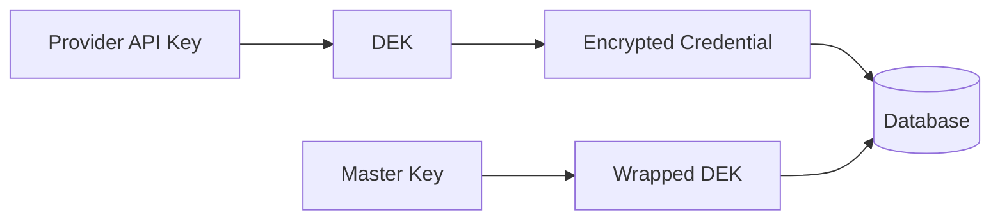

# Provider Credentials

Organizations can store their own provider API keys (OpenAI, Anthropic, Google) in Aura's database. Credentials are encrypted at rest using AES-256-GCM envelope encryption.

## How It Works

When an organization stores a provider credential:

1. A random **DEK** (Data Encryption Key) is generated
2. The credential is encrypted with the DEK using AES-256-GCM
3. The DEK is wrapped with the **Master Key** (from environment)
4. Both the encrypted credential and wrapped DEK are stored



## Setup

### 1. Generate Master Key

The master key is required for credential encryption. Generate a 32-byte key:

```bash
# Generate and set the master key
export AURA_MASTER_KEY=$(openssl rand -base64 32)
```

**Important:** Store this key securely (e.g., in a secrets manager). If lost, encrypted credentials cannot be recovered.

### 2. Configure Aura

Add to your environment or `aura.yaml`:

```bash
# Environment variable
export AURA_MASTER_KEY="your-base64-encoded-32-byte-key"
```

```yaml
# aura.yaml
security:
  master_key: ${AURA_MASTER_KEY}
```

## Storing Credentials

### Create Provider Credential

```http
POST /v1/credentials
Authorization: Bearer <admin-key>
Content-Type: application/json

{
  "provider": "openai",
  "api_key": "sk-proj-...",
  "name": "Production OpenAI Key",
  "is_default": true
}
```

Response:
```json
{
  "id": "cred_abc123",
  "provider": "openai",
  "name": "Production OpenAI Key",
  "is_default": true,
  "is_active": true,
  "created_at": "2026-01-27T12:00:00Z"
}
```

**Note:** The API key is never returned after creation—only the credential ID.

### List Credentials

```http
GET /v1/credentials
Authorization: Bearer <admin-key>
```

Response:
```json
{
  "credentials": [
    {
      "id": "cred_abc123",
      "provider": "openai",
      "name": "Production OpenAI Key",
      "is_default": true,
      "is_active": true,
      "last_used_at": "2026-01-27T14:00:00Z"
    },
    {
      "id": "cred_def456",
      "provider": "anthropic",
      "name": "Claude API Key",
      "is_default": true,
      "is_active": true
    }
  ]
}
```

### Delete Credential

```http
DELETE /v1/credentials/{credential_id}
Authorization: Bearer <admin-key>
```

## Multi-Credential Support

Organizations can store multiple credentials per provider for:

- **Load balancing** - Distribute requests across API keys
- **Failover** - Use backup key if primary fails
- **Rate limit pooling** - Combine rate limits across keys
- **Environment separation** - Different keys for dev/staging/prod

### Setting Default Credential

```http
PATCH /v1/credentials/{credential_id}
Authorization: Bearer <admin-key>
Content-Type: application/json

{
  "is_default": true
}
```

## Request Routing

When a request comes in, Aura selects the credential:

1. **Explicit credential** - If `credential_id` is in the request
2. **Default credential** - The org's default for that provider
3. **Server credential** - Fallback to server-configured API key

```json
{
  "model": "gpt-4o",
  "input": [...],
  "credential_id": "cred_abc123"  // Optional: use specific credential
}
```

## Security

### Encryption Details

| Component | Algorithm | Key Size |
|-----------|-----------|----------|
| Credential encryption | AES-256-GCM | 256 bits |
| DEK wrapping | AES-256-GCM | 256 bits |
| Nonce | Random | 96 bits |

### Database Storage

Credentials are stored with:

```sql
provider_credentials (
  id UUID PRIMARY KEY,
  organization_id UUID REFERENCES organizations,
  provider_name VARCHAR(50),
  name VARCHAR(255),
  encrypted_api_key BYTEA,     -- Encrypted with DEK
  wrapped_dek BYTEA,           -- DEK wrapped with master key
  nonce BYTEA,                 -- Unique per credential
  is_default BOOLEAN,
  is_active BOOLEAN,
  created_at TIMESTAMPTZ
)
```

### Key Rotation

To rotate the master key:

1. Generate new master key
2. Decrypt all credentials with old key
3. Re-encrypt with new key
4. Update `AURA_MASTER_KEY` environment variable
5. Restart Aura

**Note:** Key rotation requires downtime. Plan accordingly.

## Best Practices

1. **Use secrets manager** - Store `AURA_MASTER_KEY` in HashiCorp Vault, AWS Secrets Manager, etc.
2. **Rotate regularly** - Rotate both master key and provider API keys periodically
3. **Audit access** - Monitor credential usage via request logs
4. **Limit scope** - Use credentials with minimal required permissions
5. **Separate environments** - Use different credentials for dev/staging/prod
6. **Backup master key** - Store encrypted backup of master key securely

## Troubleshooting

### "Master key not configured"

```json
{
  "error": {
    "code": "configuration_error",
    "message": "AURA_MASTER_KEY is required for credential storage"
  }
}
```

**Solution:** Set the `AURA_MASTER_KEY` environment variable.

### "Invalid credential"

```json
{
  "error": {
    "code": "invalid_credential",
    "message": "Credential not found or inactive"
  }
}
```

**Solution:** Check that the credential exists and `is_active` is true.

### "Decryption failed"

```json
{
  "error": {
    "code": "decryption_error",
    "message": "Failed to decrypt credential"
  }
}
```

**Solution:** Verify the master key matches the one used during encryption.
