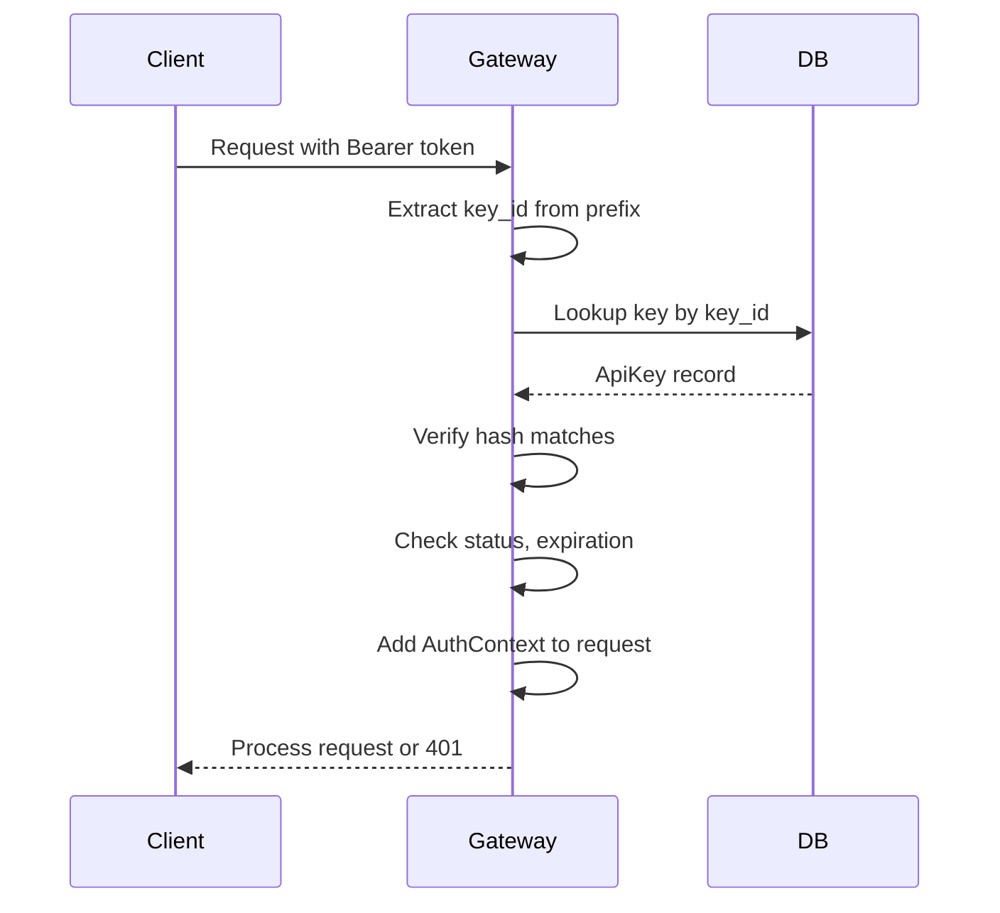

# Authentication

Aura LLM Gateway uses API key authentication to secure access to the API and track usage per organization.

## Overview

All API requests must include a valid API key in the `Authorization` header:

```bash
curl -X POST https://api.aura.example/v1/responses \
  -H "Authorization: Bearer aura_live_abc123..." \
  -H "Content-Type: application/json" \
  -d '{"model": "gpt-5.4-mini", "input": [...]}'
```

## API Key Format

API keys follow a structured format for easy identification:

```
aura_live_<random_32_chars>   # Production keys
aura_test_<random_32_chars>   # Test/development keys
```

The prefix indicates the environment, and the key is never stored in plaintext—only a SHA-256 hash is kept in the database.

## Authentication Flow



## API Key Scopes

API keys can be scoped to limit their permissions:

| Scope | Description |
|-------|-------------|
| `responses:create` | Create new responses (default) |
| `responses:read` | Read response history |
| `conversations:read` | Read conversation data |
| `conversations:write` | Manage conversations |
| `usage:read` | View usage statistics |
| `*` | Full access (admin keys) |

## Hierarchical API Keys

API keys can be scoped to different levels in the organization hierarchy:

```
Organization
├── Team A
│   ├── Project 1 → API Key (project-scoped)
│   └── Project 2 → API Key (project-scoped)
└── Team B
    └── API Key (team-scoped)
```

**Scope Types:**

| Scope Type | Description |
|------------|-------------|
| `organization` | Access to entire org (default) |
| `team` | Limited to specific team |
| `project` | Limited to specific project |
| `user` | Personal API key |

## Rate Limiting

Each API key can have rate limits configured:

- **`rate_limit_rpm`**: Requests per minute (null = default)
- **`monthly_token_limit`**: Max tokens per month (null = unlimited)
- **`current_month_tokens`**: Usage counter (auto-resets monthly)

When limits are exceeded, the API returns `429 Too Many Requests`.

## Creating API Keys

### Request

```http
POST /v1/api-keys
Authorization: Bearer <admin-key>
Content-Type: application/json

{
  "name": "Production Backend",
  "description": "Main application backend",
  "scopes": ["responses:create", "responses:read"],
  "rate_limit_rpm": 100,
  "monthly_token_limit": 1000000,
  "expires_in_days": 365
}
```

### Response

```json
{
  "key": "aura_live_a1b2c3d4e5f6...",  // Only returned once!
  "key_id": "aura_live_a1b2c3",
  "name": "Production Backend",
  "scopes": ["responses:create", "responses:read"],
  "created_at": "2026-01-26T12:00:00Z",
  "expires_at": "2027-01-26T12:00:00Z"
}
```

**Important:** The full API key is only returned once at creation. Store it securely—it cannot be retrieved later.

## Listing API Keys

```http
GET /v1/api-keys
Authorization: Bearer <admin-key>
```

Returns all keys for the authenticated organization (without the secret portion):

```json
{
  "keys": [
    {
      "key_id": "aura_live_a1b2c3",
      "name": "Production Backend",
      "scopes": ["responses:create"],
      "status": "active",
      "last_used_at": "2026-01-26T14:30:00Z",
      "created_at": "2026-01-26T12:00:00Z"
    }
  ]
}
```

## Revoking API Keys

```http
DELETE /v1/api-keys/{key_id}
Authorization: Bearer <admin-key>
```

Revoked keys immediately stop working. This action cannot be undone.

## End-User Tracking

When making requests, include the `user` field to track costs per end-user:

```json
{
  "model": "gpt-5.4-mini",
  "input": [...],
  "user": "customer_12345"
}
```

This enables:
- Per-customer billing and cost allocation
- Per-user rate limiting
- Usage reporting by customer
- Blocking abusive users

The gateway automatically:
1. Upserts the end-user in the database
2. Records usage against the end-user
3. Checks if the user is blocked
4. Enforces per-user rate limits (if configured)

## Provider Credentials

Organizations can store encrypted provider credentials (OpenAI, Anthropic, Google API keys) in the database. These are encrypted using AES-256-GCM envelope encryption:

1. A random DEK (Data Encryption Key) is generated per credential
2. The credential is encrypted with the DEK
3. The DEK is wrapped with the master key (from `AURA_MASTER_KEY` env var)
4. Both the encrypted credential and wrapped DEK are stored

This allows organizations to use their own provider API keys while keeping them secure.

## Error Responses

### 401 Unauthorized

```json
{
  "error": {
    "code": "invalid_api_key",
    "message": "Invalid or missing API key"
  }
}
```

### 403 Forbidden

```json
{
  "error": {
    "code": "insufficient_scope",
    "message": "API key does not have required scope: usage:read"
  }
}
```

### 429 Too Many Requests

```json
{
  "error": {
    "code": "rate_limit_exceeded",
    "message": "Rate limit exceeded. Try again in 60 seconds."
  }
}
```

## Security Best Practices

1. **Never commit API keys** to version control
2. **Use environment variables** for API keys in production
3. **Rotate keys regularly** (create new key, update apps, revoke old key)
4. **Use minimal scopes** - only grant permissions that are needed
5. **Set expiration dates** on keys when possible
6. **Monitor usage** for unusual patterns
7. **Use separate keys** for different environments (dev, staging, prod)
