# Aura LLM Gateway Architecture

## System Overview

Aura is a high-performance LLM gateway built in Rust that provides a unified API for multiple LLM providers. It implements the [Open Responses API](https://openresponses.org) specification for agentic workflows.

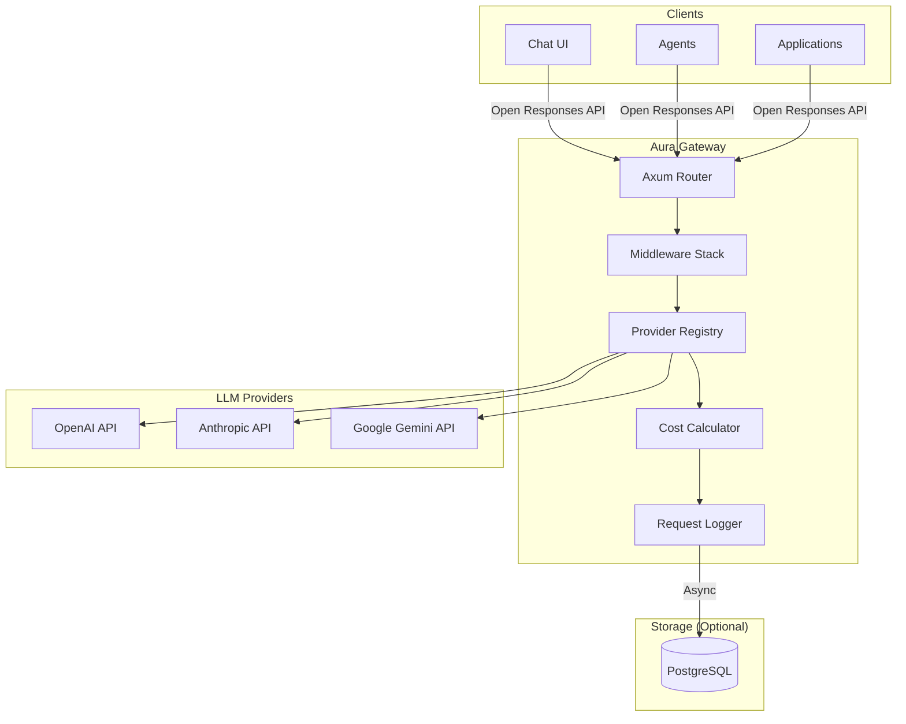

## Crate Architecture

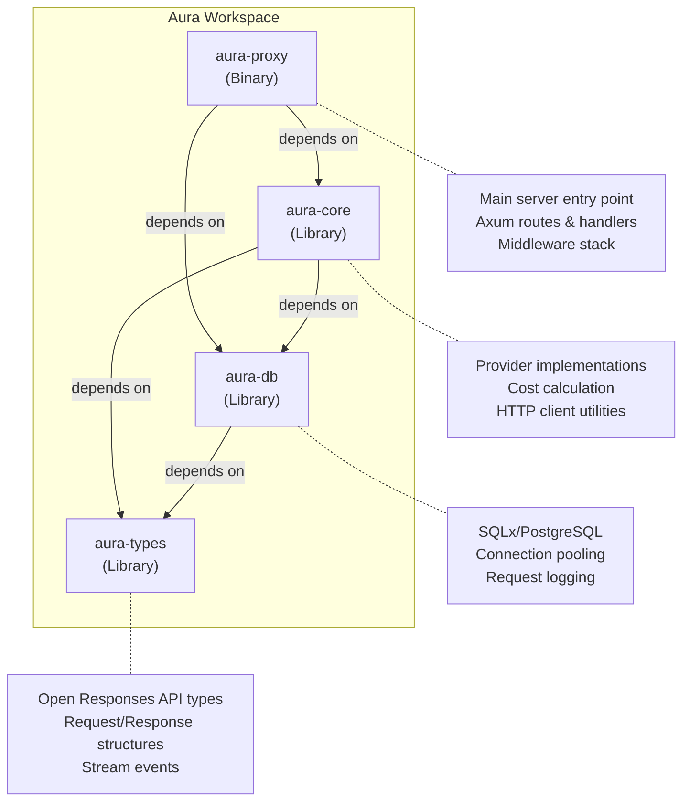

## Request Flow

### Non-Streaming Request

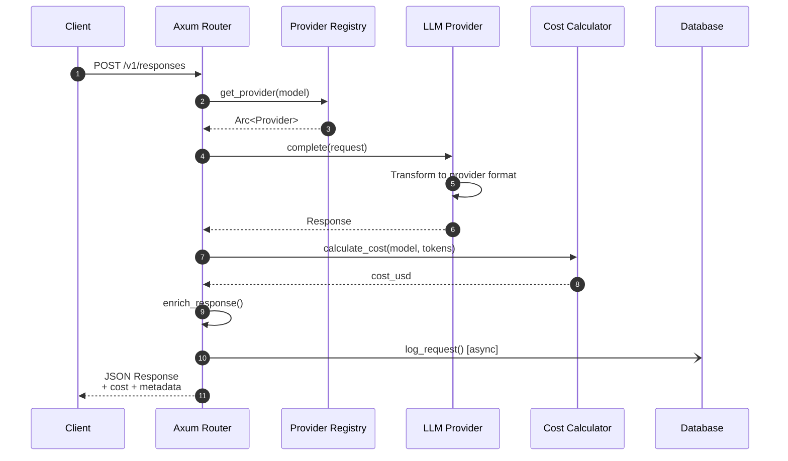

### Streaming Request

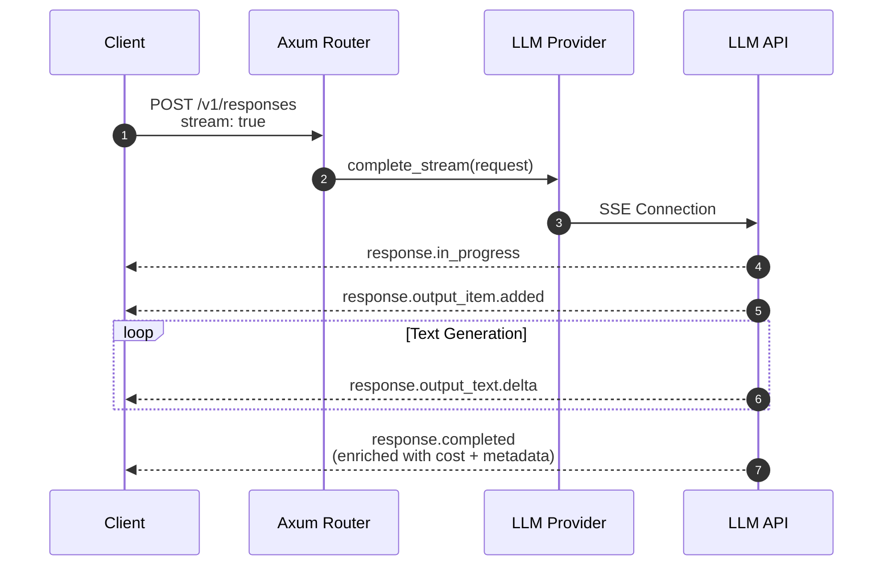

## Component Details

### Authentication & Multi-Tenancy

Aura supports a hierarchical organization model with API key authentication:

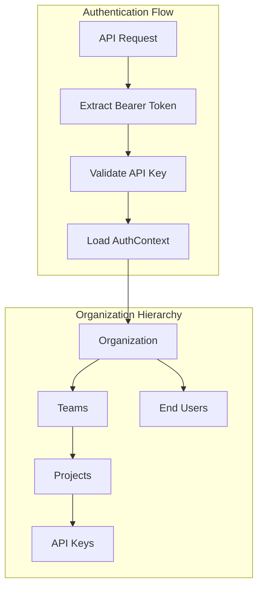

**Key Components:**

- **Organizations**: Top-level billing entities with owner and members
- **Teams**: Departments or product groups within an organization
- **Projects**: Specific initiatives under teams
- **API Keys**: Scoped to org, team, project, or user level
- **End Users**: Consumer/client users for cost allocation

### Credential Encryption

Provider credentials are stored using AES-256-GCM envelope encryption:

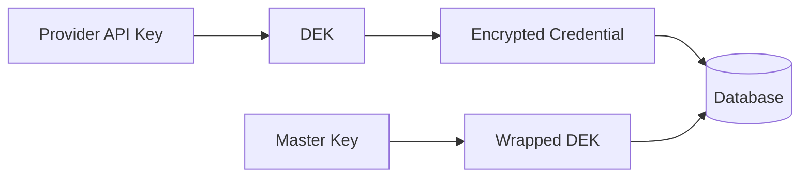

- **DEK (Data Encryption Key)**: Randomly generated for each credential
- **MEK (Master Encryption Key)**: Environment variable for key wrapping
- **Nonce**: Unique per encryption operation

### Provider System

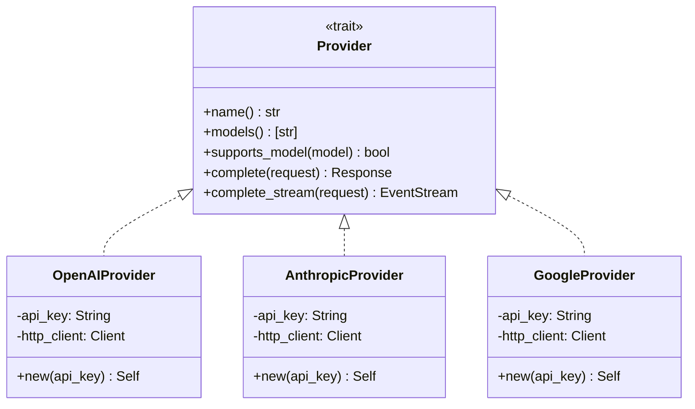

### Response Enrichment

Every response is enriched with Aura-specific metadata:

```json
{
  "id": "resp_abc123",
  "model": "gpt-4o",
  "status": "completed",
  "output": [...],
  "usage": {
    "input_tokens": 100,
    "output_tokens": 50,
    "cost_usd": 0.00075
  },
  "metadata": {
    "aura": {
      "request_id": "aura_550e8400-e29b-41d4-a716-446655440000",
      "model": "gpt-4o",
      "provider": "openai",
      "gateway_version": "0.1.7",
      "latency_ms": 523,
      "agentic": {
        "output_items_count": 2,
        "has_tool_calls": true,
        "tool_calls_count": 1,
        "tools_used": ["web_search"],
        "requires_action": false
      }
    }
  }
}
```

### Database Schema

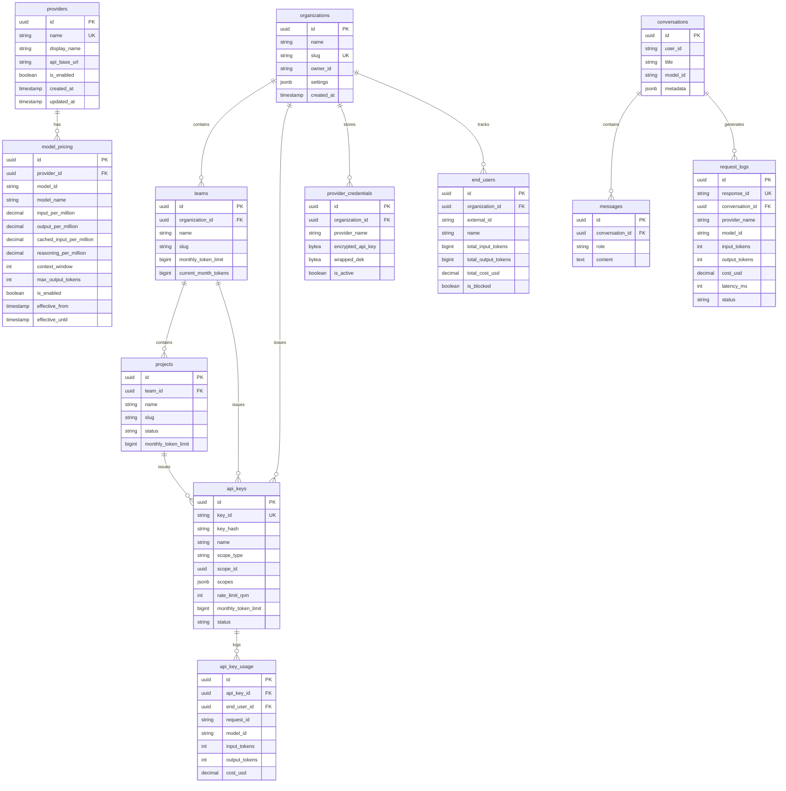

## Data Flow Summary

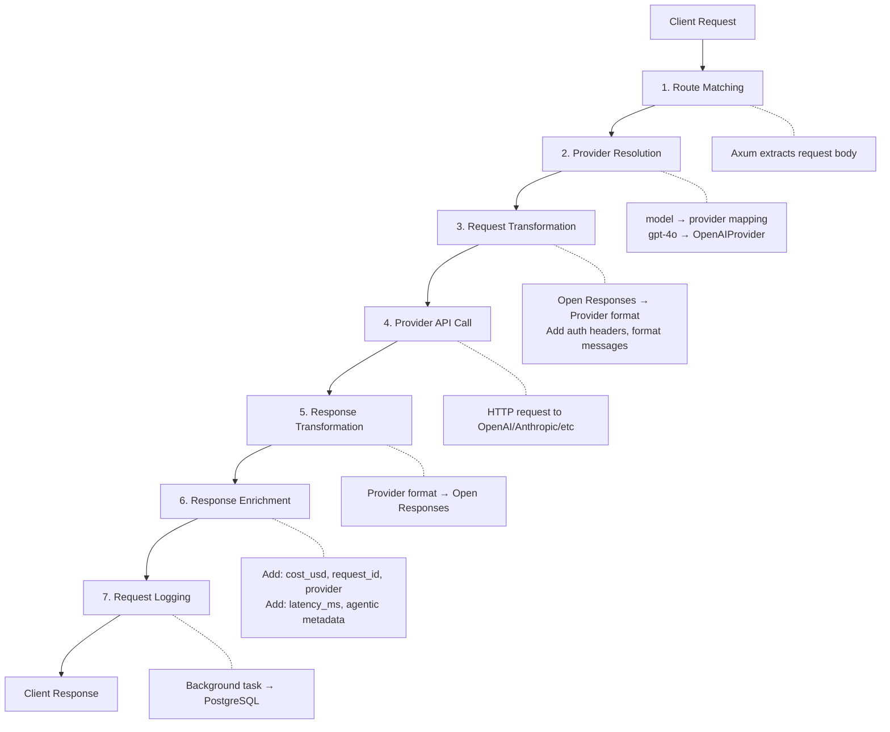

## State Management

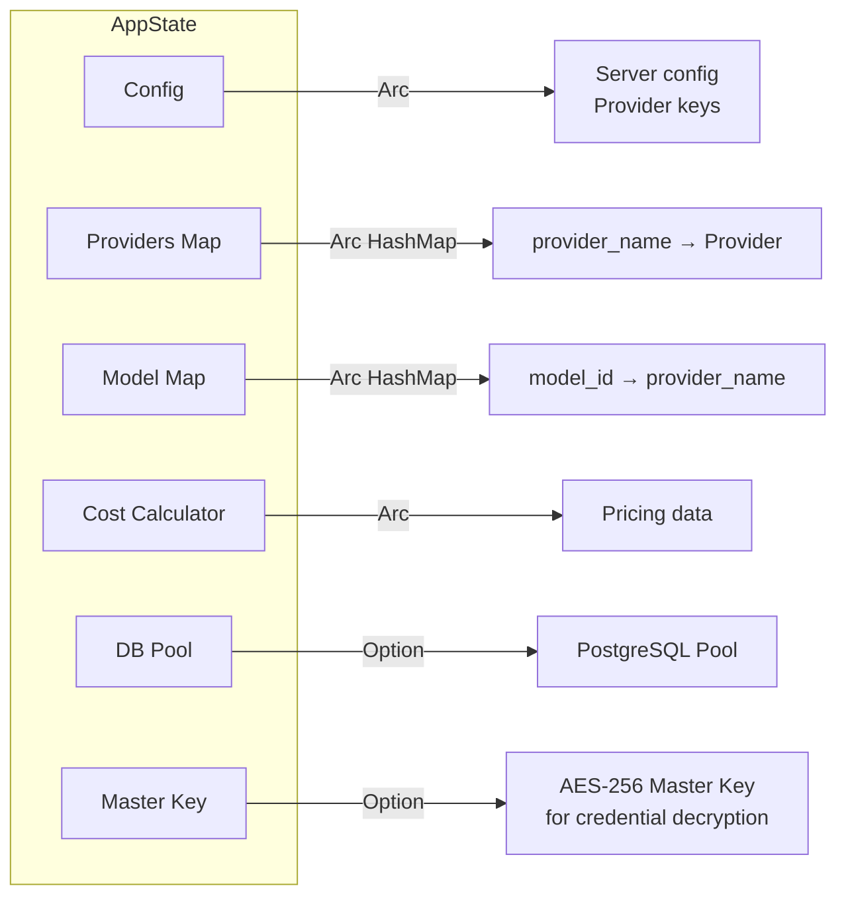

## End-User Tracking

The gateway tracks end-user costs via the `user` field in API requests:

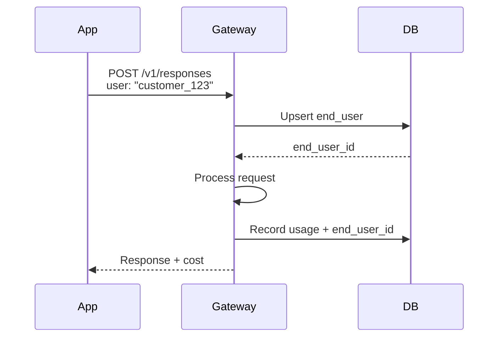

This enables:
- Per-customer billing and cost allocation
- Per-user rate limiting
- Usage reporting by customer
- Blocking abusive users

## Configuration

```yaml
# aura.yaml
server:
  host: "0.0.0.0"
  port: 8080

providers:
  openai:
    api_key: ${OPENAI_API_KEY}
  anthropic:
    api_key: ${ANTHROPIC_API_KEY}
  google:
    api_key: ${GOOGLE_API_KEY}

database:
  url: ${DATABASE_URL}  # Optional
  max_connections: 10
```

## Future Architecture (Planned)

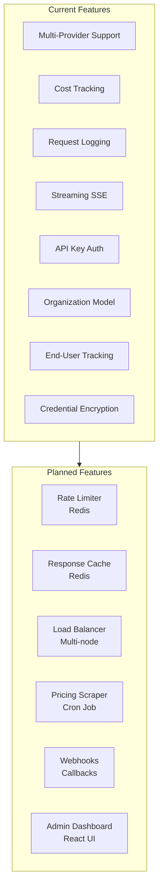

## Error Handling Flow

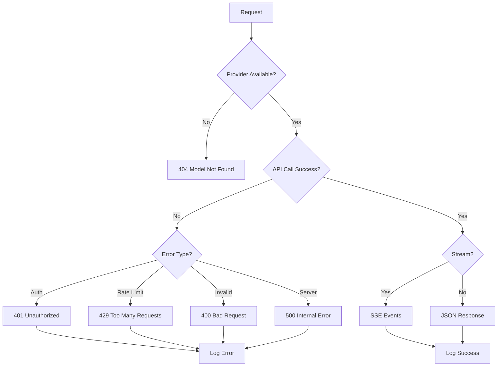
